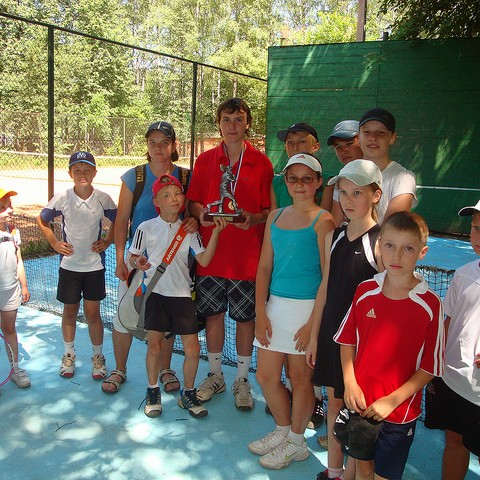

<p align="center">

</p>

# Nano-vLLM Prefill-Only

A specialized optimization of [nano-vllm](https://github.com/GeeeekExplorer/nano-vllm) for **prefill-only** inference tasks, designed for industrial-scale discriminative applications with multimodal large language models.

> **Motivation**: This project addresses the problem described in [vllm-project/vllm#29584](https://github.com/vllm-project/vllm/issues/29584) — vLLM unconditionally allocates KV cache even for non-autoregressive tasks (embedding, reranking, classification), wasting up to **80-98% of GPU memory** on completely unused cache tensors. The vLLM maintainers acknowledged this issue but noted that fixing it "would require modifications to a lot of core code" and closed it as not planned. Our framework solves this by **completely eliminating KV cache allocation** for prefill-only workloads, enabling single-GPU deployment of models that would otherwise require multi-GPU setups under vLLM.

> **Real-world showcase**: [NanoJev](https://github.com/86MaxCao/NanoJev) — a fork of the [parallel decision model](https://github.com/TianyuCodings/NanoJev) that scores all candidate action paths in a single prefill (zero output-token decoding) — runs its Qwen3-0.6B backbone on this engine: **2.0x–4.7x faster** end-to-end than the HF transformers backend (growing with batch size), with verified numerical parity (probability max abs diff ≤ 0.009 on 300 real held-out states; argmax 298/300, both flips near-ties). Parity tables, benchmarks and integration details are in the fork's README.

## 🎯 Why Prefill-Only?

Most real-world business scenarios are **prefill-only tasks**, especially in discriminative applications:

- **Reranking**: Determining the relevance of documents to queries
- **Retrieval/Embedding**: Generating vector representations for semantic search
- **Classification**: Binary or multi-class classification tasks
- **Visual Question Answering**: Answering yes/no questions about images
- **Spatial Reasoning**: Comparing object sizes, positions, or relationships
- **Attribute Recognition**: Identifying colors, shapes, or other visual attributes

### Industrial Applications

In industrial settings, multimodal LLMs are increasingly replacing traditional discriminative vision models for tasks like:

- **Object Detection Queries**: "Is there a dog in this image?" (Binary classification)
- **Spatial Comparisons**: "Which object is larger?" or "Which is on the left?"
- **Attribute Classification**: "What color is the building?" (Red/Black/White/Blue/Yellow/Green/Gray)
- **Multimodal Retrieval**: Finding the most relevant image from a large collection, e.g., "Find the image that best represents traditional Chinese architecture" from thousands of building photos
- **Multimodal Reranking**: Ranking images by relevance, e.g., "Which shop sign is most eye-catching?" from a collection of street photos, or "Which product image best matches the query description?"

### Practical Example: COCO Val2017 Images

All examples below use [COCO val2017](https://cocodataset.org/) images. Each task completes in a **single forward pass** — no autoregressive token-by-token decoding.

---

**1. Single-Token Classification**

<p align="center"></p>

> **Question**: "Is there a bear in the picture? Answer yes or no."

```
┌────────────┐     ┌─────────────────────┐     ┌─────────┐
│   Image    │────▶│   Model (Prefill)   │────▶│  "Yes"  │
│  + Prompt  │     │ Single Forward Pass │     │ 1 token │
└────────────┘     └─────────────────────┘     └─────────┘
```

The model reads the entire image and prompt in one pass, then outputs a **single token**. No KV cache needed — no next-token loop.

---

**2. Multimodal Embedding**

<p align="center"></p>

> **Task**: Map this outdoor scene to a dense vector for semantic search.

```
┌────────────┐     ┌─────────────────────┐     ┌──────────────────────────┐
│   Image    │────▶│   Model (Prefill)   │────▶│ [0.12, -0.34, 0.56, ...] │
│  + Text    │     │ Single Forward Pass │     │   hidden_size-dim vector │
└────────────┘     └─────────────────────┘     └──────────────────────────┘
```

The model encodes the image-text pair into a **fixed-length vector** in one pass. This vector can be indexed for retrieval across millions of images — all without KV cache.

---

**3. Multimodal Reranking**

<p align="center">
&nbsp;&nbsp;
&nbsp;&nbsp;

</p>

> **Query**: "A white building"

```
┌──────────────┐     ┌─────────────────────┐     ┌────────────────────┐
│  Query       │     │                     │     │ Image 1: 0.11      │
│  + Image 1   │────▶│   Model (Prefill)   │────▶│ Image 2: 0.05      │
│  + Image 2   │     │ Single Forward Pass │     │ Image 3: 0.93  ✓   │
│  + Image 3   │     │                     │     │                    │
└──────────────┘     └─────────────────────┘     └────────────────────┘
```

The model scores each image-query pair in a **single forward pass** and outputs a relevance score. The building image ranks highest — no decoding loop involved.

---

All three tasks — classification, embedding, and reranking — are **prefill-only**: the model processes all input tokens in one forward pass with no autoregressive decode loop. When processing **hundreds of millions of images** at scale, the traditional vLLM approach wastes GPU memory on KV cache that is never reused. Our prefill-only optimization eliminates this overhead entirely.

## 🚀 Key Features

* ⚡ **Optimized for Single-Token Generation** - No KV cache overhead for discriminative tasks
* 💾 **Massive Memory Savings** - Up to **10x less memory** compared to original nano-vllm
* 🎯 **Industrial-Scale Ready** - Designed for high-throughput discriminative inference
* 🔧 **Based on nano-vllm** - Built on top of the clean, readable nano-vllm codebase
* 🧩 **[Hybrid Prefilling](https://arxiv.org/abs/2505.07203)** - Chunk MLP execution to reduce peak activation memory by **70%+** for long video understanding (see [`feat/hybrid-prefilling`](../../tree/feat/hybrid-prefilling) branch)
* 🔢 **M-RoPE Support** - Native multimodal 3D rotary position embedding (t/h/w) for Qwen3-VL and Qwen2.5-VL, covering both the interleaved (`mrope_interleaved`) and chunked layouts — verified bit-exact against HF Transformers

## 📊 Performance Benchmarks

All benchmarks measured on a single NVIDIA H20 GPU (96GB). Speed measured as median latency over 30 iterations (10 warmup rounds, 2σ outlier removal) unless otherwise noted. VRAM measured via `torch.cuda.max_memory_allocated()` in isolated subprocesses.

### Speed Comparison: Text Models (batch=100)

| Model | Category | Transformers (s) | Prefill-Only (Ours) (s) | Speedup |
|-------|----------|:-----------------:|:-----------------------:|:-------:|
| Qwen3-0.6B | Generation | 0.0524 | 0.0309 | **1.70x** |
| Qwen3.5-0.8B | Generation | 0.0413 | 0.0824 | 0.50x* |
| Qwen3-Embedding-0.6B | Embedding | 0.0330 | 0.0242 | **1.36x** |
| bge-multilingual-gemma2 | Embedding | 0.2613 | 0.1595 | **1.64x** |
| Qwen3-Reranker-0.6B | Reranking | 0.1574 | 0.0610 | **2.58x** |
| bge-reranker-v2-gemma | Reranking | 0.1736 | 0.1162 | **1.49x** |


### Speed Comparison: Multimodal Models (batch=10, 224x224 images)

| Model | Category | Transformers (s) | Prefill-Only (Ours) (s) | Speedup |
|-------|----------|:-----------------:|:-----------------------:|:-------:|
| Qwen3-VL-2B-Instruct | Generation | 0.1059 | 0.0736 | **1.44x** |
| Qwen3.5-0.8B | Generation | 0.0817 | 0.2132 | 0.38x* |
| Qwen2.5-VL-3B-Instruct | Generation | 0.1212 | 0.0594 | **2.04x** |
| Qwen3-VL-Embedding-2B | Embedding | 0.0766 | 0.0707 | **1.08x** |
| Qwen3-VL-Reranker-2B | Reranking | 0.0906 | 0.0830 | **1.09x** |

> Both Transformers and Prefill-Only use FlashAttention. End-to-end measurement includes preprocessing (tokenization/apply_chat_template + image processing).
>
> \* Qwen3.5 uses GatedDeltaNet (GDN) linear attention which requires per-sequence state isolation during prefill. Batched GDN prefill is implemented via Triton `cu_seqlens` (processing all sequences in a single kernel call), but remains slower than Transformers' native batch dimension due to cu_seqlens kernel overhead and engine-level scheduling costs.

### Speed Comparison vs vLLM (torch.compile, max_tokens=1)

| Model | Category | vLLM (s) | Prefill-Only (Ours) (s) | Speedup | Batch |
|-------|----------|:--------:|:-----------------------:|:-------:|:-----:|
| Qwen3-0.6B | Generation | 0.0599 | 0.0324 | **1.85x** | 100 |
| Qwen3-Embedding-0.6B | Embedding | 0.0366 | 0.0302 | **1.21x** | 100 |
| Qwen3-Reranker-0.6B | Reranking | 0.0640 | 0.0623 | **1.03x** | 100 |
| Qwen3-VL-2B-Instruct | Generation | 0.0676 | 0.0585 | **1.16x** | 10 |
| Qwen2.5-VL-3B-Instruct | Generation | 0.1054 | 0.0620 | **1.70x** | 10 |
| Qwen3-VL-Embedding-2B | Embedding | 0.0705 | 0.0707 | **1.00x** | 10 |
| Qwen3-VL-Reranker-2B | Reranking | 0.0758 | 0.0730 | **1.04x** | 10 |

> vLLM uses **full-graph** `torch.compile` with TorchInductor + CUDA graphs for cross-operator kernel fusion. Prefill-Only (Ours) uses **per-operator** `torch.compile` on RMSNorm, SiLU, RoPE, and Sampler. vLLM 0.19.0, `gpu_memory_utilization=0.5`, `max_model_len=4096`.
>
> **Analysis**: For generation models, our framework is **1.2–1.9x faster** even against vLLM's full-graph compile, thanks to KV cache elimination and varlen attention. For embedding, we achieve **near-parity** (0.99x–1.21x) with vLLM. For reranking with text models, vLLM's full-graph compile + CUDA graphs provides stronger optimization. Full-graph compile support for our framework is planned for a future release.

### Why Faster Than vLLM for Generation (max_tokens=1)

For generation tasks with `max_tokens=1`, both frameworks execute a single forward pass followed by one sampling step. The speedup comes from architectural differences in how each framework handles attention and request management:

**1. No Paged KV Cache**

vLLM is designed for autoregressive decoding, so its decoder attention path **always** uses paged KV cache — even for the very first (and only) prefill step. In [`vllm/v1/attention/backends/flash_attn.py`](https://github.com/vllm-project/vllm/blob/main/vllm/v1/attention/backends/flash_attn.py), the decoder `forward()` unbinds `kv_cache` into `key_cache` and `value_cache`, then passes `block_table=block_table` to `flash_attn_varlen_func`. This means q attends to k/v stored in **paged block memory** via indirect addressing, rather than the original contiguous k/v tensors.

Our framework passes `block_table=None` to `flash_attn_varlen_func` (see [`nanovllm/layers/attention.py`](nanovllm/layers/attention.py)), meaning q/k/v are contiguous tensors in memory with no indirection. For prefill-only workloads, no KV cache is ever allocated, no `slot_mapping` is populated, and no block table lookup is performed during attention.

**2. No Scheduler Overhead**

vLLM runs `scheduler.schedule()` on every engine step (see [`vllm/v1/engine/core.py:step()`](https://github.com/vllm-project/vllm/blob/main/vllm/v1/engine/core.py)). Even for `max_tokens=1`, the single forward pass goes through the full scheduling pipeline: token budget computation, request state management, preemption logic, and `update_from_output()` processing.

Our framework calls the model forward pass directly without any scheduler — requests are batched and executed immediately.

**3. Lighter Attention Metadata**

vLLM constructs a `FlashAttentionMetadata` object every step, carrying `block_table`, `slot_mapping`, `scheduler_metadata`, cascade attention fields, and decode-context-parallelism (DCP) fields. Our framework uses a minimal `Context` dataclass with only `cu_seqlens_q`, `cu_seqlens_k`, `max_seqlen_q`, `max_seqlen_k`, and optionally `block_tables` (which is `None` for prefill-only).

### Why Forward Pass is Faster

Our framework achieves faster model forward passes through multiple optimizations:

1. **Varlen FlashAttention** (`flash_attn_varlen_func`): Concatenates all sequences into a single 1D tensor with `cu_seqlens` boundaries, eliminating padding waste and attention_mask overhead.
2. **Single-Pass Vision Encoding**: Each image is encoded once during its sequence's single prefill pass; there is no autoregressive re-encoding.
3. **Fused Operators**: Per-operator `torch.compile` on RMSNorm, SiLU, RoPE, and Sampler.

**Benchmark**: Qwen3-VL-2B-Instruct, batch=10, 224x224 images, NVIDIA H20.

| Metric | Transformers (ms) | Prefill-Only (Ours) (ms) | Speedup |
|--------|:------------------:|:------------------------:|:-------:|
| Forward-only | 78.1 | 30.8 | **2.53x** |
| End-to-end | 105.9 | 73.6 | **1.44x** |
| Preprocessing (est.) | 27.8 | 42.8 | 0.65x |

**Key insight**: The forward pass itself is **2.53x faster**, but our current preprocessing pipeline (per-request `apply_chat_template` + processor) is slower than Transformers' native batch processing, which reduces the end-to-end speedup to **1.44x**. The varlen advantage grows further with **variable-length sequences** (mixed-resolution images), where Transformers wastes compute on padding tokens while our approach processes only real tokens.

### torch.compile Status

Currently, our framework applies `@torch.compile` to **individual operators** (RMSNorm, SiLU, RoPE, Sampler) but does NOT perform **full-graph compilation** or **cross-operator kernel fusion**. In contrast, vLLM v1 compiles the entire model forward pass as a single graph, enabling TorchInductor to fuse adjacent operators (e.g., RMSNorm output directly into linear input) and reduce memory bandwidth by ~20%.

This is a known optimization gap. Full-graph `torch.compile` support for prefill-only workloads is planned for a future release.

### VRAM Comparison: Prefill-Only vs vLLM (Minimum Utilization)

Measured on a single **NVIDIA H20 (96 GiB)** with vLLM 0.19.0. Minimum viable `gpu_memory_utilization` verified with 0.001 step and 3x repetition (each value must succeed 3/3 times to be considered stable).

| Model | Category | Prefill-Only (Ours) | vLLM Min Util | vLLM Min VRAM | vLLM Max Fail Util | vLLM Max Fail VRAM | Ratio |
|-------|----------|:-------------------:|:-------------:|:-------------:|:------------------:|:------------------:|:-----:|
| Qwen3-0.6B | Text Generation | 1,703 MB | 0.041 | 3.94 GiB | 0.040 | 3.84 GiB | **2.4x** |
| Qwen3-Embedding-0.6B | Text Embedding | 1,177 MB | 0.023 | 2.21 GiB | 0.022 | 2.11 GiB | **1.9x** |
| bge-multilingual-gemma2 | Text Embedding | 17,665 MB | 0.217 | 20.83 GiB | 0.216 | 20.74 GiB | **1.2x** |
| Qwen3-Reranker-0.6B | Text Reranking | 1,453 MB | 0.042 | 4.03 GiB | 0.041 | 3.94 GiB | **2.8x** |
| bge-reranker-v2-gemma | Text Reranking | 4,818 MB | 0.090 | 8.64 GiB | 0.089 | 8.54 GiB | **1.8x** |
| Qwen3-VL-2B-Instruct | Multimodal Generation | 4,812 MB | 0.081 | 7.78 GiB | 0.080 | 7.68 GiB | **1.7x** |
| Qwen2.5-VL-3B-Instruct | Multimodal Generation | 7,370 MB | 0.104 | 9.98 GiB | 0.103 | 9.89 GiB | **1.4x** |
| Qwen3-VL-Embedding-2B | Multimodal Embedding | 4,780 MB | 0.080 | 7.68 GiB | 0.079 | 7.58 GiB | **1.6x** |
| Qwen3-VL-Reranker-2B | Multimodal Reranking | 4,844 MB | 0.084 | 8.06 GiB | 0.083 | 7.97 GiB | **1.7x** |

> **vLLM Min Util** = minimum `gpu_memory_utilization` at which vLLM can load the model (3/3 successes). **vLLM Max Fail Util** = maximum `gpu_memory_utilization` at which vLLM OOMs (0/3 successes, provided for reproducibility). **vLLM Min VRAM** = vLLM Min Util × 96 GiB. **Ratio** = vLLM Min VRAM / Prefill-Only (Ours) VRAM. Even at minimum utilization, vLLM requires **1.2–2.8x** more VRAM.

## 📦 Installation

```bash
git clone https://github.com/86MaxCao/nano-vllm-prefillonly.git
cd nano-vllm-prefillonly
pip install -e .
```

**Dependencies**: Python 3.10+, PyTorch 2.4+, Transformers 4.51+, Flash-Attention, Triton.

## 🎮 Quick Start

### Text Generation

```python
from nanovllm import LLM, SamplingParams

# max_tokens_hint=1 tells the engine you only need one token per prompt,
# so it skips KV-cache allocation entirely.
llm = LLM("Qwen/Qwen3-0.6B", max_tokens_hint=1)
sp = SamplingParams(temperature=0.0, max_tokens=1)

prompts = ["Is the Earth round? Answer Yes or No."] * 100
tokens = llm.generate_single_token(prompts, sp)  # list[int], one per prompt
```

### Multimodal Generation

```python
from nanovllm import LLM, SamplingParams
from transformers import AutoProcessor
from PIL import Image

llm = LLM("Qwen/Qwen3-VL-2B-Instruct", multimodal_model_type="qwen3_vl")
processor = AutoProcessor.from_pretrained("Qwen/Qwen3-VL-2B-Instruct")
sp = SamplingParams(max_tokens=1)

images = [Image.open(f"image_{i}.jpg") for i in range(10)]
requests = [
    {
        "messages": [{"role": "user", "content": [
            {"type": "image", "image": img},
            {"type": "text", "text": "What is in this image? Answer in one word."},
        ]}],
        "images": [img],
    }
    for img in images
]

results = llm.generate_multimodal(requests, sp, processor)
```

### Text Embedding

```python
from nanovllm import LLM

llm = LLM("Qwen/Qwen3-Embedding-0.6B", is_embedding=True)

texts = ["What is deep learning?", "Explain transformers", "What is NLP?"]
embeddings = llm.embed_batch(texts)  # [batch_size, hidden_size]
```

### Multimodal Embedding

```python
from nanovllm import LLM
from PIL import Image

llm = LLM("Qwen/Qwen3-VL-Embedding-2B", multimodal_model_type="qwen3_vl", is_embedding=True)

images = [Image.open("photo.jpg")]
texts = ["A photo of a building"]
embeddings = llm.embed_batch(texts, images=images)  # [batch_size, hidden_size]
```

### Text Reranking

```python
from nanovllm import LLM

llm = LLM("Qwen/Qwen3-Reranker-0.6B", is_reranker=True)

pairs = [
    ("What is AI?", "Artificial intelligence is the simulation of human intelligence."),
    ("What is Python?", "Python is a programming language."),
]
scores = llm.rerank_batch(pairs)  # [batch_size]
```

### Multimodal Reranking

```python
from nanovllm import LLM
from PIL import Image

llm = LLM("Qwen/Qwen3-VL-Reranker-2B", multimodal_model_type="qwen3_vl", is_reranker=True)

images = [Image.open("photo.jpg")]
pairs = [("Find a building", "A document about architecture")]
scores = llm.rerank_batch(pairs, images=images)  # [batch_size]
```

## 🏗️ Supported Models

| Model | Type | `multimodal_model_type` | Extra Args |
|-------|------|------------------------|------------|
| Qwen3-0.6B | Text Generation | - | - |
| Qwen3-Embedding-0.6B | Text Embedding | - | `is_embedding=True` |
| bge-multilingual-gemma2 | Text Embedding | - | `is_embedding=True` |
| Qwen3-Reranker-0.6B | Text Reranking | - | `is_reranker=True` |
| bge-reranker-v2-gemma | Text Reranking | - | `is_reranker=True` |
| Qwen3-VL-2B-Instruct | Multimodal Generation | `qwen3_vl` | - |
| Qwen2.5-VL-3B-Instruct | Multimodal Generation | `qwen2_5_vl` | - |
| Qwen3-VL-Embedding-2B | Multimodal Embedding | `qwen3_vl` | `is_embedding=True` |
| Qwen3-VL-Reranker-2B | Multimodal Reranking | `qwen3_vl` | `is_reranker=True` |

> `multimodal_model_type` can be auto-detected from model path (e.g., paths containing "qwen3" + "vl" auto-resolve to `qwen3_vl`). Explicit specification is only needed when auto-detection fails.

## 📝 Current Status

**What Works:**
- Single-token generation for text and multimodal models
- Text and multimodal embedding with batch processing
- Text and multimodal reranking with batch processing
- Memory-efficient inference without KV cache
- Accuracy matching with Transformers baseline

**Known Limitations:**
- Multi-token autoregressive decoding is out of scope. This engine is prefill-only (embedding, reranking, single-token generation). Some flash-attn builds have a broken paged-KV-cache kernel; when detected, `max_tokens > 1` is refused with a clear error rather than returning silently wrong tokens.
- Full-graph `torch.compile` not yet supported (only per-operator compile)

## 🏗️ Architecture

Built on [nano-vllm](https://github.com/GeeeekExplorer/nano-vllm). Key optimizations:

1. **No KV Cache** - Eliminates cache allocation entirely for prefill-only tasks
2. **Varlen FlashAttention** - Concatenates sequences into 1D tensor, eliminates padding waste
3. **Batch Preprocessing** - Batch `apply_chat_template` + batch processor calls

## 📄 License

MIT License (inherited from [nano-vllm](https://github.com/GeeeekExplorer/nano-vllm)).

## 🙏 Acknowledgments

- [nano-vllm](https://github.com/GeeeekExplorer/nano-vllm) by [GeeeekExplorer](https://github.com/GeeeekExplorer)
